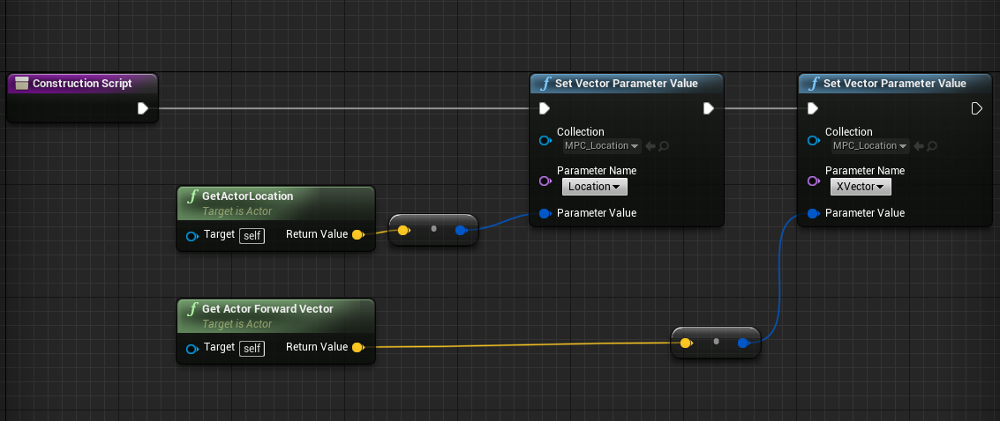
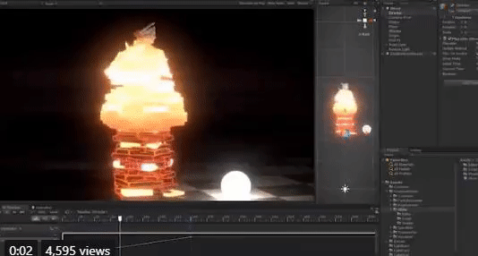
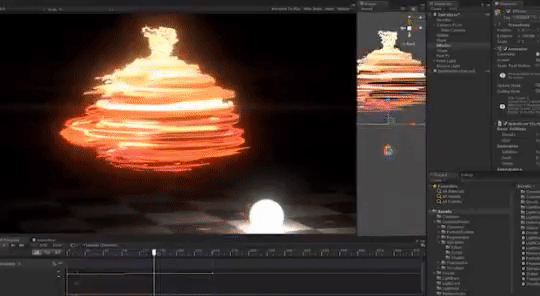
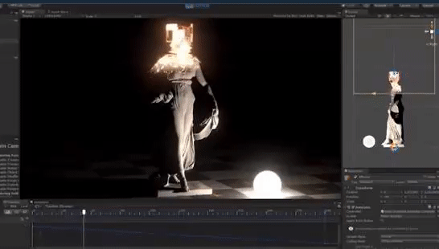
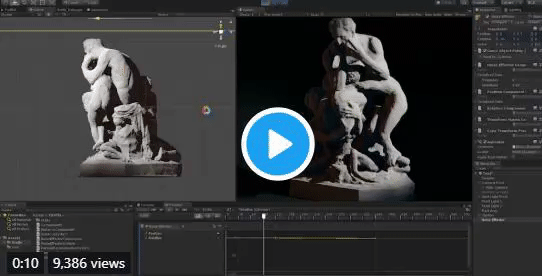
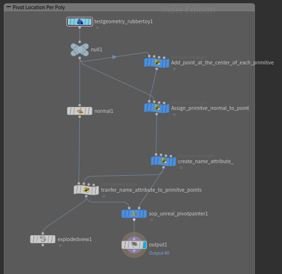
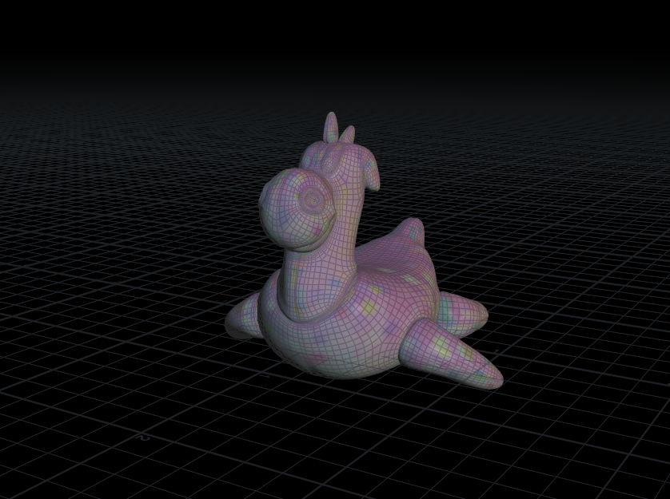
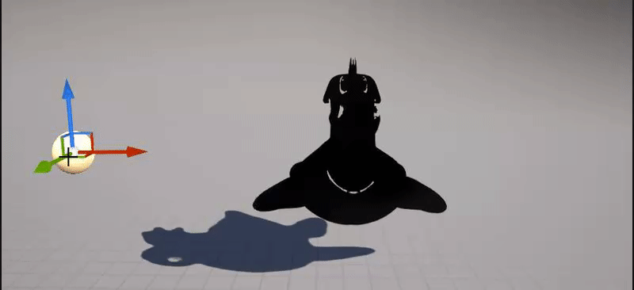
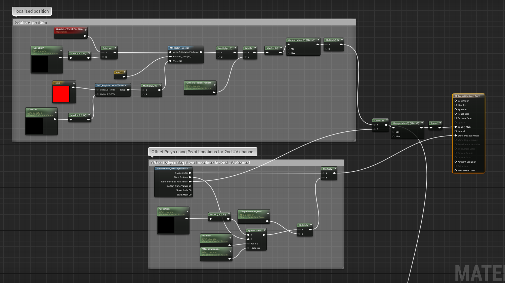

# Taizyd Korambayil SDGM-560 Blog
## Week 1 - Transition Effect Prototype _09/14/2018_

For the first week as we as a group decided on what the project would be and the kind of effect we are doing. Since we are dealing with 
a transition effect where a car transforms from and old model into another I decided to do a quick prototype shader in UE4 that we could use as a Previs element in out pitch.

The shader is essentially driven by a linear gradient generated from the Forward Vector of a Location Blueprint. The geometry is masked and swapped based on which side of the locator BP it is on.

**Shader Nodes**

The Location of the Blueprint Actor is fed into the shader using a Material Parameter Collection fo Convenience.

**BP Locator Setup**

For the final effect we intend to make use of Houdini's game sheld tools to bake out Pivot Points and also bring in cached geometry animation from houdini and implement these in Unreal using shaders and Blueprints to drive them in real time.

**FX Reference**              
 

 

 

  
## Week 2 - Pivot Painter R&D _09/25/2018_

This week I spent some time looking into the Game Shelf Tools in Houdini, specifically the **Pivot Painter SOP**. I used this tool to bake out seperate pivot locations for each poly on the surface of the car into the UV channels, and accessed them in unreal to create the dissappation effect. The limit with this effect is that it is dictated by the topology of the Mesh.

**Houdini Setup**
Below you can see the setup I am using to bake pivot locations to each face, I scatter points at the center of each poly, and transfer a name attribute to the points that make up each primitve so it knows which scattered point to use as it's pivot. The Pivot Painter SOP then bakes these locations into additional UV channels of the mesh.

**Network**

**Setup in Unreal Engine**
In Unreal I modified my Shader from last week to make use of the baked pivot locations to displace the polys based on the location of the blueprint to drive the Transition. There are Parameters to control Displacement Amt, Falloff and Effect Radius. 

Displacement Amt: 32

Displacement Amt: 512
 

Shader Network:

**Test on Car Model**
 

**Troubleshooting:**
The Pivot Painter SOP sometimes still exports geometry with incorrect Pivot Locations and flipped faces, resulting in unclean geometry inside unreal.

**Next Step:**
The next step is to try and export pivot locations for each part of the car so that we can prototype the Disassmbly type effect that was suggested by Todd last week.

